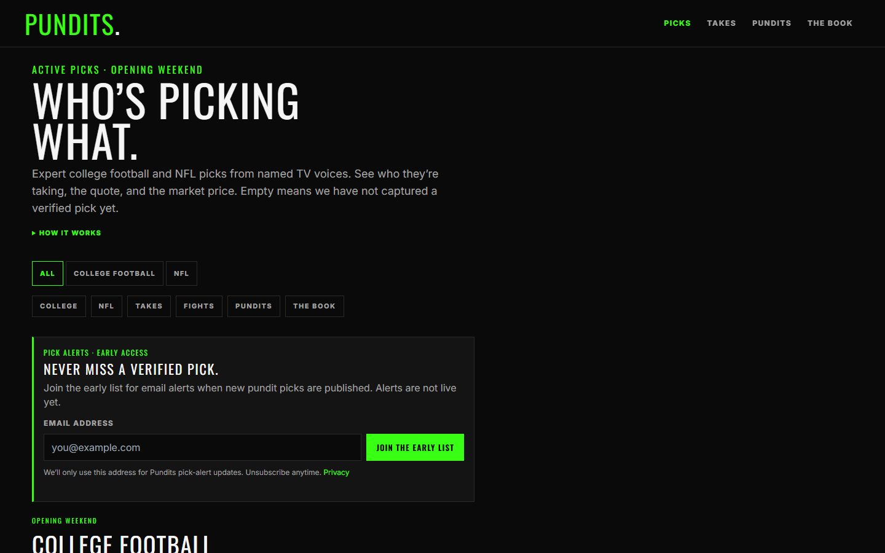
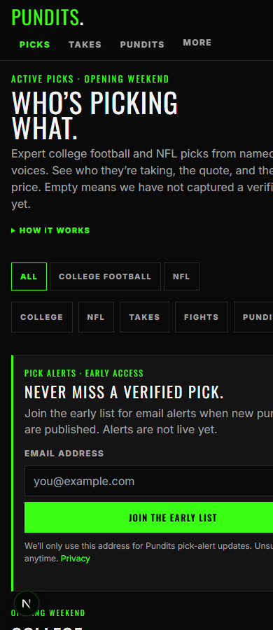

# Pundits UI/UX audit — sports fan / sports gambler perspective

Status: Evidence

Date: 2026-08-28
Method: rendered local app (main branch), headless-browser screenshots at desktop 1440×900 fold, full-page 1440px, and ~mobile width. Evaluated as two personas: a college football / NFL fan who follows TV pundits, and a sports gambler who lives in sportsbook apps.

Note on mobile captures: headless Edge clamps windows to ~500px minimum width, so the "mobile" shots render at 500px. Proportions are representative; exact 390px behavior was not re-verified on-device.

## Verdict

The product underneath is genuinely differentiated — sourced quotes, frozen Kalshi prices, a public accountability ledger. The two biggest problems are both about what a first-time visitor meets before that differentiation: (1) the email capture box owns the first screen on every viewport, and (2) the fold contains zero picks. A gambler's snap-read of the current first screen is "tout site collecting emails," which is the exact opposite of the brand.

## Finding 1 — The email CTA owns the fold (agree with the instinct; it's the top issue)

At 1440×900 the visible page is: header, headline, lede, collapsed "How it works", two chip rows, then the email box. The brightest element on screen is the solid-green "JOIN THE EARLY LIST" button — the visual hierarchy declares that the page's primary action is surrendering an email. On mobile the box fills essentially the entire first screen; not a single pick, price, or face is visible without scrolling on any viewport.

Three compounding problems:

- **Value before ask is inverted.** The form asks for an email for a feature that (per its own copy) "is not live yet," before the site has shown a single piece of content.
- **It pattern-matches to tout services.** "Never miss a verified pick" + email gate is the signature UX of pick-selling operations. Gamblers are the most tout-burned audience on the internet; this framing spends trust the accountability concept is supposed to earn.
- **Placement double-hit on detail pages.** On `/picks/[slug]` the same box interrupts between the market card and Expert Takes (see 07), splitting the evidence in half.

Recommendations, in order of preference:

1. Move the home form below the first content section (after College Football, or between NFL and Takes). Let the marquee cards sell the alert.
2. Shrink it to a one-line inline band (label + input + button) rather than a bordered hero-scale panel; reserve the big treatment for a post-scroll or exit placement.
3. On pick detail, move it below Expert Takes, scoped copy is already good there.
4. Copy pass: "Never miss a verified pick" is tout-voice. Accountability-voice sells better here, e.g. "Get new picks — with the receipt." Keep "Alerts are not live yet" honesty; it reads better *after* the product has demonstrated value.

## Finding 2 — The fold has no product in it

Even with the email box gone, the first screen would be headline + lede + chips. The single most compelling asset — a marquee game card with faces on sides and cents — never appears above the fold, and on desktop the right half of the hero is empty black (the headline column is ~560px in a 1080px shell).

Recommendation: make the hero a split — headline/lede left, the top marquee matchup card (LSU–Clemson with Pate + Finebaum faces) live on the right. That one change shows the entire product concept in the first second: game, faces, price. On mobile, tighten the hero so the first card crests the fold.

## Finding 3 — Two look-alike chip rows fight each other

The sport filter (`ALL / COLLEGE FOOTBALL / NFL`) and the jump row (`COLLEGE / NFL / TAKES / FIGHTS / PUNDITS / THE BOOK`) are styled identically and stacked. Both contain "NFL" and a college label — same words, different behaviors (filter vs. anchor scroll). A first-time fan cannot predict which does what, and "FIGHTS" appears here before the concept has been introduced.

Recommendation: keep the sport filter as chips; restyle the jump row as plain text anchor links (like a mini table-of-contents) or drop it — the page is one scroll and the sections have loud headers. If both stay, they must not share a visual grammar.

## Finding 4 — Cents-only prices exclude sportsbook-native readers

A gambler's mental model is American odds or a percentage. `75¢` requires translation ("¢ = implied %, roughly"), and nothing on the card offers it. Kalshi users are a small subset of the audience; DraftKings/FanDuel users are the mass.

Recommendations:

- Dual-display or toggle: `75¢ · ≈ −300` (or `75% implied`). Even a title/tooltip would help.
- Drop YES/NO from primary card UI. On detail, LSU is labeled `NO · HOME` — the side both pundits picked is labeled "NO," which reads as negative to anyone who doesn't know Kalshi contract structure. Teams are the language; contract side belongs in Market details.

## Finding 5 — Empty states outweigh content

On the current home + slate pages, a large share of card sides read "No verified pundit pick yet," and Miami–Stanford / Baylor–Auburn show em-dash prices with both sides empty — dead cards that look broken. Pre–Week 1 this is partly unavoidable, but the surfaces can be curated:

- Home: only cards with ≥1 verified face (the marquee rule), ranked by pick count then game quality.
- Slate pages: group "has picks" above "waiting," and give waiting cards a compact single-row treatment instead of a full empty two-column card.
- The lede currently spends its second sentence explaining emptiness ("Empty means we have not captured a verified pick yet") — move that to card-level microcopy; don't lead the site with a caveat.

## Finding 6 — The disagreements are buried

"Hottest fights" — pundits on both sides of a market — is the single best gambler content on the site (fade-or-follow is the core gambler behavior), and Herbstreit 9¢ vs 91¢ against-the-field cards are genuinely fun. It sits fifth, below two slates and the takes rail.

Recommendation: when a real fight exists, promote one to the hero area or directly under the first slate with head-to-head faces ("Herbstreit takes Indiana · Thamel against"). Also unify naming: "Hottest fights" / "FIGHTS" chip / "Still open" kicker are three labels on one concept.

## Finding 7 — Time and urgency are underplayed

Week 0 kicks off tomorrow (Sat Aug 29) and nothing says so. Dates render as flat metadata (`SAT AUG 29, 2026 · 12:00 ET`). Fans run on countdown energy.

Recommendation: relative tags on game cards — `TOMORROW · 12:00 ET`, `TONIGHT`, then `FINAL` post-grade. Cheap to compute at build time given the daily deploy cadence.

## Finding 8 — Trust signals exist but whisper

The differentiators — quote + source + date + "Open source →", frozen-price provenance, the not-a-tout disclaimer — are all present but live in small muted text and a collapsed `How it works`. Meanwhile the loudest element is an email form (Finding 1).

Recommendation: a one-line trust bar under the lede in place of the email box: "Real quotes, linked to source. Prices frozen from Kalshi. After the game, we mark who was right." That sentence is the brand; it should not be behind a disclosure triangle.

## Finding 9 — Smaller polish items

- **Leaderboard**: heading says "THE TABLE.", nav says "PUNDITS", home section says "Top 10" — three names for one surface. The `2026 0–0` column is dead weight until games grade; consider hiding the record column until Week 0 settles, since a "Top 10" ranked purely by pick volume reads as arbitrary.
- **Pundit photos**: crops are non-uniform (some full-body, varying backgrounds/resolutions). Uniform square head crops would noticeably raise perceived quality; faces are the identity system.
- **Expert Takes block on pick detail** duplicates the quotes already shown in the market card directly above (07) — cut it or make it the SEO-only text.
- **"The Book"** still reads as "sportsbook" to a gambler; expecting an odds board, they get a ledger. The Takes-page framing ("The Book is the same takes as a dense list") is good — make sure the nav item gets the same one-line explainer at the top of the page itself.
- **Desktop hero dead space** (right half of shell) — solved by Finding 2's split hero.

## What's working (keep)

- The Oswald green-on-black broadcast identity is distinctive, appropriate to the subject, and consistent across every page.
- Game cards with team chips + face-on-the-side-they-picked communicate the core concept without explanation.
- Takes feed cards (face, quote, price, source, date) are excellent — the strongest surface on the site.
- Sourcing discipline (Open source → links, freeze dates, honest disclaimers) is the moat; every recommendation above is about moving it forward, not changing it.

## Priority order

1. Move/shrink the email capture (Finding 1) — highest impact, lowest effort.
2. Put a marquee card in the hero (Finding 2).
3. De-conflict the chip rows (Finding 3).
4. Curate empty cards + move the emptiness caveat out of the lede (Finding 5).
5. American-odds display and YES/NO retirement from cards (Finding 4).
6. Promote fights + relative game-time tags (Findings 6–7).
7. Trust bar + polish items (Findings 8–9).

## Evidence

- 01 — desktop 1440×900 fold: email box is the fold, zero picks visible
- 02 — mobile-width fold: email box fills the first screen
- 03 — full desktop home
- 04 — NCAAF slate (empty-side and em-dash cards)
- 05 — Takes feed
- 06 — leaderboard
- 07 — pick detail (email box splitting market from Expert Takes)
