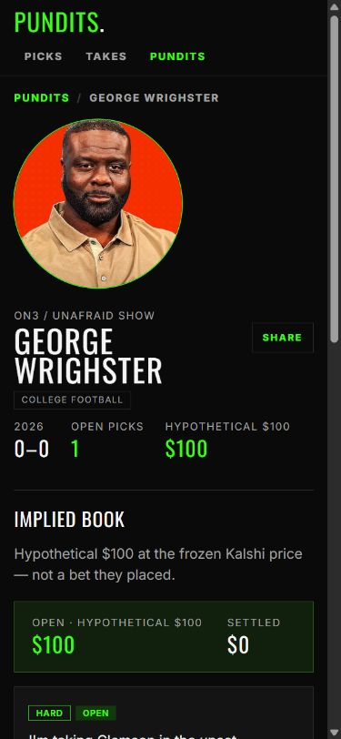
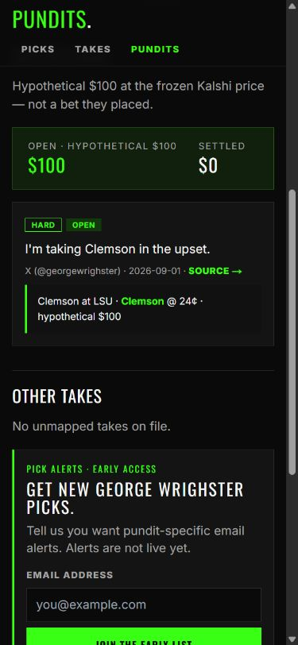
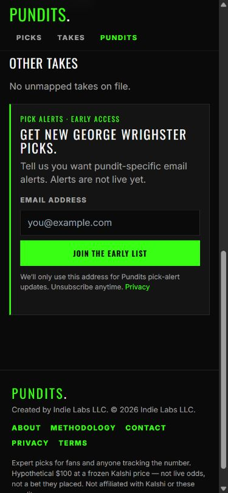
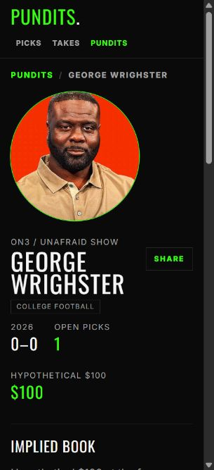
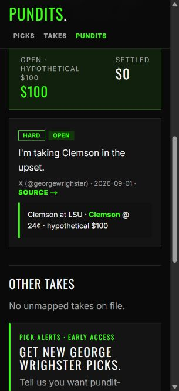
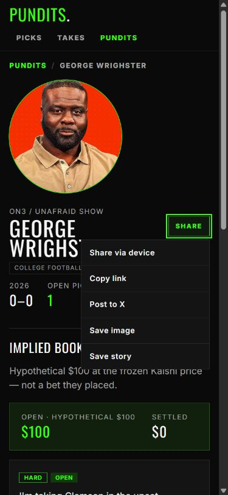

# Wrighster profile mobile UX audit

Status: Evidence

Date: 2026-09-01

Surface: `https://pundits.pro/pundits/wrighster/`

## Audit scope

This is a combined mobile UX and accessibility pass on the public pundit-profile page. The tested states were the initial profile view, the mapped-pick receipt, the alert signup, the narrow 320 px reflow, and the share menu.

Viewports:

- 390 × 844
- 320 × 700

The user goal is to recognize the pundit, find their current pick and evidence quickly, understand whether they have a settled record, and optionally follow or share the profile.

## Overall verdict

The page is visually distinctive, responsive, and trustworthy at the evidence level. Its mobile information order is the main problem: the face, three statistics, and hypothetical-dollar summary appear before the first pick. On the narrowest supported width, the profile reads as a market ledger before it reads as a pick receipt.

## Step 1 — 390 px profile entry: needs hierarchy work

Strengths:

- The portrait, name, outlet, and active navigation state establish identity immediately.
- The green/black broadcast system remains legible and recognizably Pundits.Pro.
- The layout reflows without horizontal overflow.

Risks:

- The current pick does not appear in the first viewport.
- `0–0`, `Open picks 1`, and two hypothetical-dollar values compete for attention before the quote.
- `Implied book` makes secondary market analysis sound like the primary product.

## Step 2 — 390 px current pick: understandable but internally framed

Strengths:

- The exact quote, source, date, event, side, and frozen price are present.
- Open state and source evidence are visually distinguishable.

Risks:

- `Hard` is internal eligibility language, not a useful fan label.
- `Other takes` followed by `No unmapped takes on file` exposes the internal mapping model and creates a dead section.
- The source link is approximately 70 × 14 px, well below a comfortable touch target.
- The receipt link looks like dense metadata rather than the primary route to the full receipt.

## Step 3 — 390 px alert signup: healthy control, weak promise

Strengths:

- The email field and submit button are full width and 44 px high.
- The early-access limitation and privacy link are visible.

Risks:

- `Tell us you want pundit-specific email alerts` sounds like internal product research rather than a clear user benefit.
- The empty `Other takes` section delays the signup without adding value.

## Step 4 — 320 px profile entry: reflow works, scan breaks

Strengths:

- Navigation remains usable and no content overflows horizontally.
- The long name and Share control coexist without collision.

Risks:

- The third statistic wraps to an orphaned second row.
- The 192 px portrait and repeated market summary push the first receipt well below the entry screen.
- The Share toggle is approximately 71 × 34 px; the width is sufficient, but the height is below the 44 px mobile target used elsewhere.

## Step 5 — 320 px current pick: readable, but actions are undersized

Strengths:

- The quote wraps cleanly.
- The frozen 24¢ price remains visible without horizontal scrolling.

Risks:

- The Source target remains about 14 px high.
- The receipt link text occupies about 182 × 36 px even though its surrounding visual block is larger; the whole block should be the target.
- The accessibility snapshot joins the adjacent badges as `hardOpen`, which may produce an unclear announcement.

## Step 6 — 390 px share menu: mostly healthy

Strengths:

- The menu opens within the viewport.
- Every menu item is approximately 44 px high.
- The expanded state is exposed semantically.

Risk:

- The trigger itself remains shorter than 44 px.

## Recommended mobile order

`Identity → tracked picks and receipts → hypothetical record → more takes when present → pick-alert signup`

This keeps personality first, moves the verifiable pick into the first mobile scan, and preserves the frozen-price analysis as supporting context.

## Highest-impact changes

1. Move mapped picks above the hypothetical-dollar summary.
2. Replace the three-stat wrap with two primary profile facts: open picks and graded sample/record.
3. Do not print `0–0` as though it were a record when the pundit has no graded picks; say `No graded picks yet` or `0 graded`.
4. Rename `Implied book` to `Hypothetical record` and keep its disclaimer.
5. Hide the empty Other takes section; when populated, label it `More takes`.
6. Hide the internal `Hard` badge on mapped profile receipts.
7. Make Share, Source, and the full receipt row at least 44 px high.
8. Use benefit-led alert copy while retaining the honest early-access limitation.

## Evidence limits

- This pass did not submit the email form or trigger a device share.
- Screenshots and DOM inspection can identify target-size and semantic risks, but they do not establish full WCAG compliance.
- Contrast ratios, screen-reader output, zoom at 200%, focus-ring appearance, and error recovery still require implementation-time testing.
- Production currently contains the Wrighster record used here, while the local checkout does not. The screenshots are the visual acceptance reference; implementation must not add or edit editorial JSON merely to recreate the fixture.
