# Base UI mobile audit

## Scope

- Surface: local Pundits mobile experience.
- Viewports: 390 x 844, with a 320 x 568 narrow-screen check.
- Flow: home discovery, compact ledger, filter drawer, leaderboard tabs, and a pick receipt.
- Goal: identify mobile UI improvements and distinguish Base UI opportunities from layout/CSS work.

## Verdict

The Base UI pilot is sound. The drawer and tabs behave correctly at both tested widths, preserve the broadcast styling, and avoid horizontal overflow. The highest-impact mobile issues are not framework gaps: the home page puts a tall event card before the product explanation, long ledger pages lose their filter controls while scrolling, and receipt actions are visually compressed into small inline links.

## Implementation status

Completed on 2026-09-03:

- The mobile home copy now appears before the marquee card.
- The compact-ledger search and filter bar remains sticky below the site header.
- The Base UI drawer now has a visible, labeled close control.
- Receipt source actions and market disclosures meet a 44 px minimum target.
- Leaderboard tabs meet a 44 px minimum target and the show-all control has clearer copy.
- Home “How it works” now uses the shared Base UI Collapsible pattern.

Post-implementation evidence:

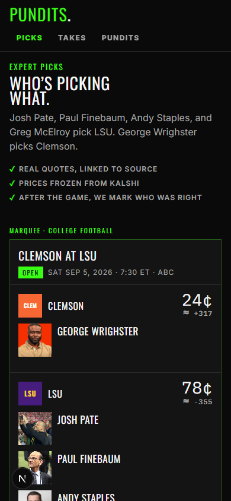

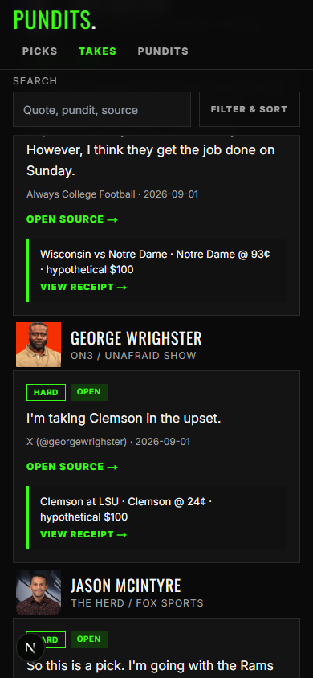

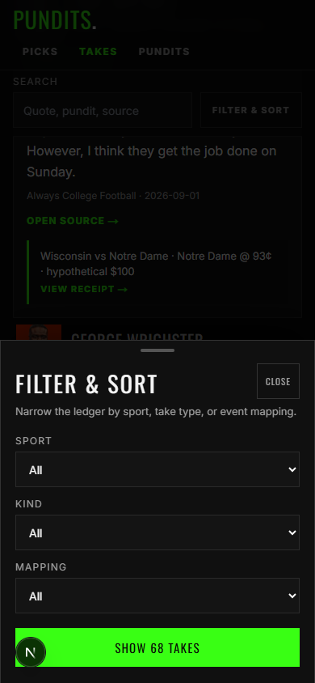

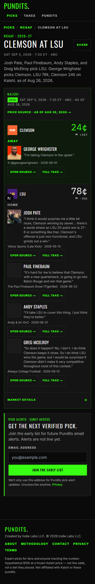

## Steps and findings

### 1. Home entry — needs improvement

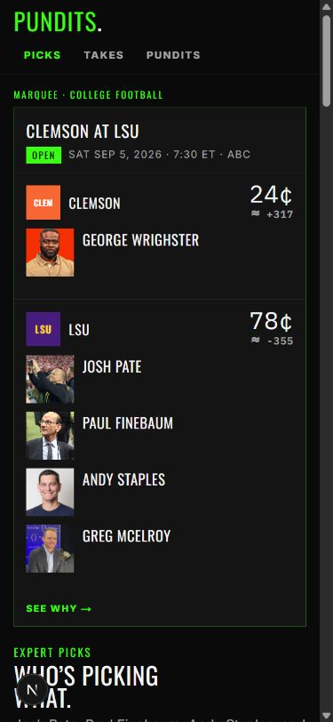

The marquee card consumes almost the entire first viewport, while “Who’s picking what” only begins at the bottom. A new visitor sees an event before understanding the product. Put the hero copy first on mobile or introduce a shorter mobile marquee treatment. This is a CSS/hierarchy fix, not a Base UI migration.

### 2. Compact ledger entry — healthy, with a long-scroll risk

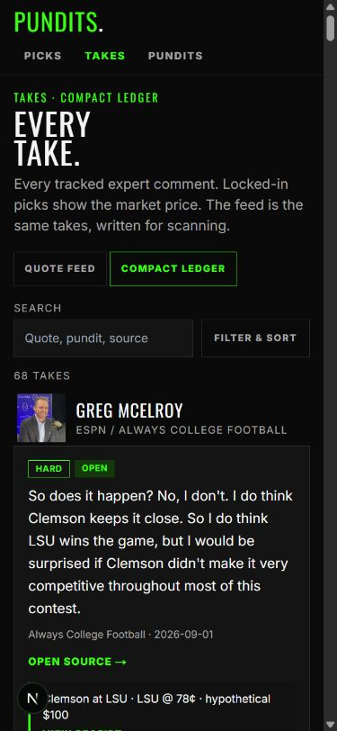

Search, view switching, result count, and the first take are easy to scan. The page is extremely long (25,356 CSS pixels at 320 px wide), so the search and filter controls disappear early. Keep a compact sticky filter bar available after the header collapses. Continue using the Base UI drawer for the expanded controls.

### 3. Filter drawer — strong, minor affordance gap

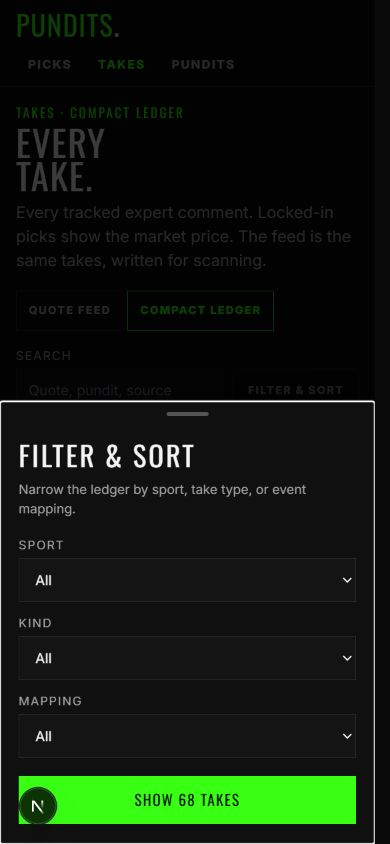

The dialog hierarchy is clear, the native selects are appropriate on mobile, and the primary action remains visible. Add an explicit, labeled `Drawer.Close` control near the title; swipe, backdrop click, and the submit action should not be the only visible dismissal cues.

### 4. Leaderboard results — healthy, minor clarity issue

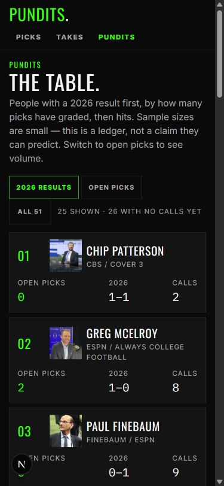

The Base UI tabs fit comfortably and the cards reflow well. The tab controls measure about 40 px high, slightly below a preferred 44 px touch target. “All 51” is ambiguous; “Show all 51 pundits” would be clearer.

### 5. Pick receipt — usable, but action links are too compressed

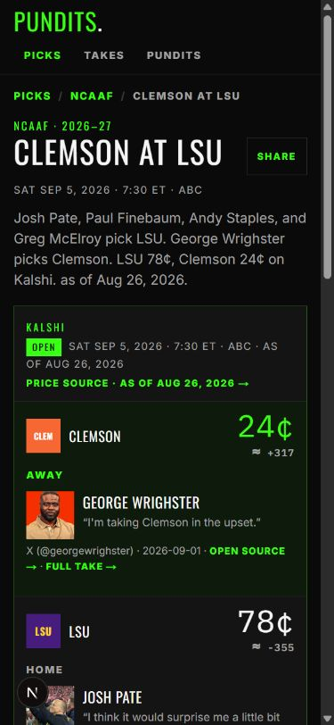

The event hierarchy and frozen-price context read well. Several source and receipt actions render as 13–31 px-high inline links, and they wrap into metadata at narrow widths. Give “Open source” and “Full take” a dedicated action row with at least 44 px targets. This is component/CSS work; Base UI is not needed.

### 6. Ledger at 320 px — usable

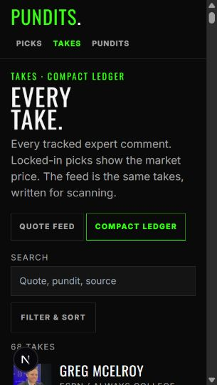

The search and filter controls stack without horizontal overflow. Spacing becomes tight but remains readable.

### 7. Drawer at 320 px — healthy

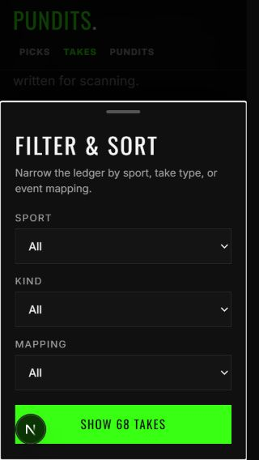

The drawer fits the narrow viewport and keeps all three fields plus the primary action visible. Retain native selects rather than replacing them with custom Base UI selects; the platform picker is the better mobile interaction here.

### 8. Open-picks leaderboard tab — healthy

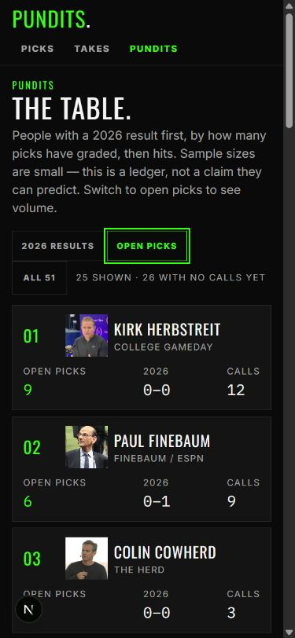

The Base UI tab correctly changes the sort and presents a strong visible focus state. Preserve this implementation and increase the tab height to 44 px.

## Recommended implementation order

1. Move or compact the mobile home marquee so the product explanation appears in the first viewport.
2. Convert receipt metadata actions into 44 px tap targets.
3. Add a sticky mobile ledger toolbar that reopens the existing Base UI drawer.
4. Add a visible drawer close control and increase leaderboard tab height.
5. Optionally migrate the home “How it works” disclosure to the existing Base UI Collapsible pattern for consistency.

## Accessibility limits

The review confirmed visible hierarchy, responsive reflow, dialog semantics, labels, focus styling, and target dimensions. It does not establish full WCAG compliance; screen-reader announcements, zoom behavior, reduced-motion behavior, and complete keyboard traversal still require dedicated assistive-technology testing.
