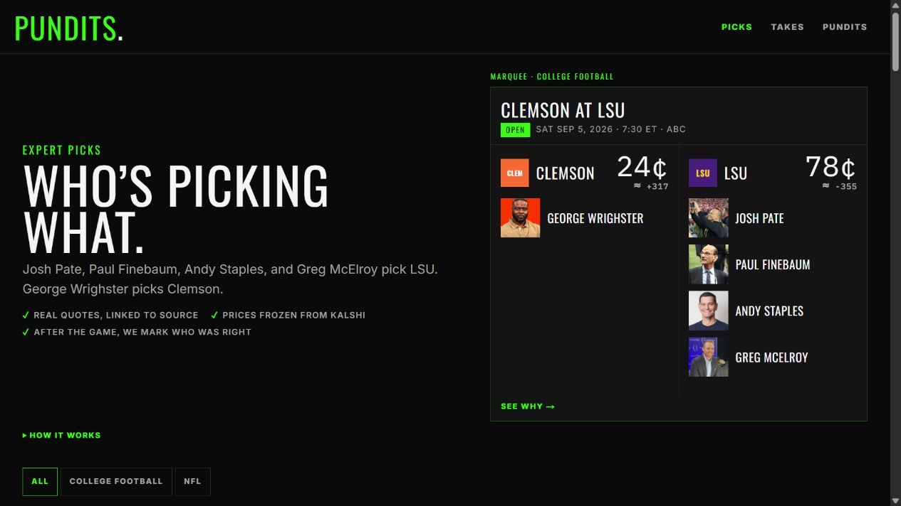
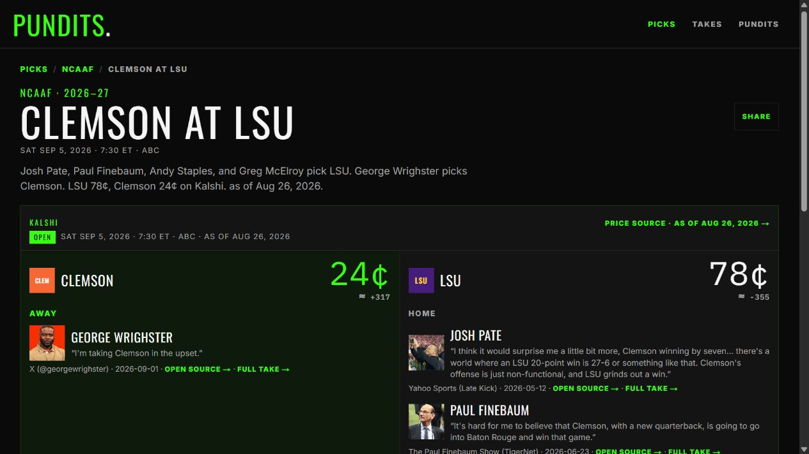
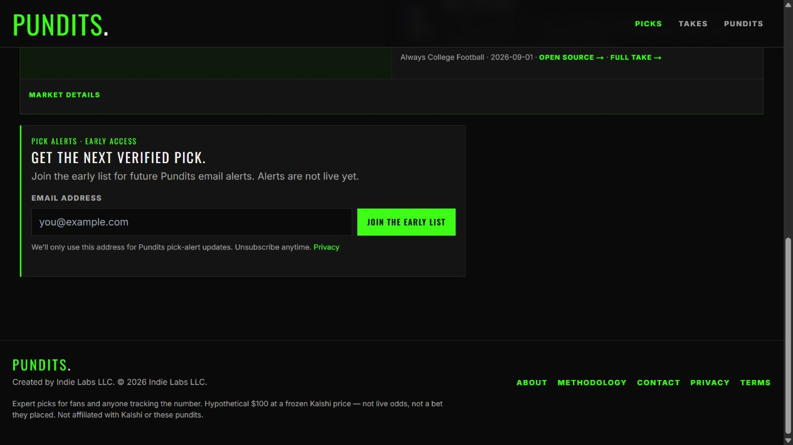
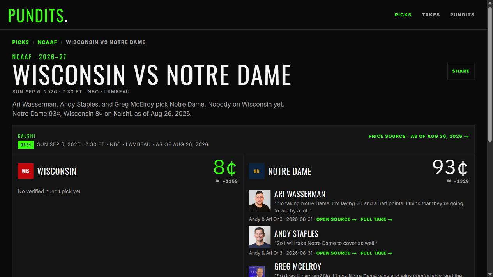
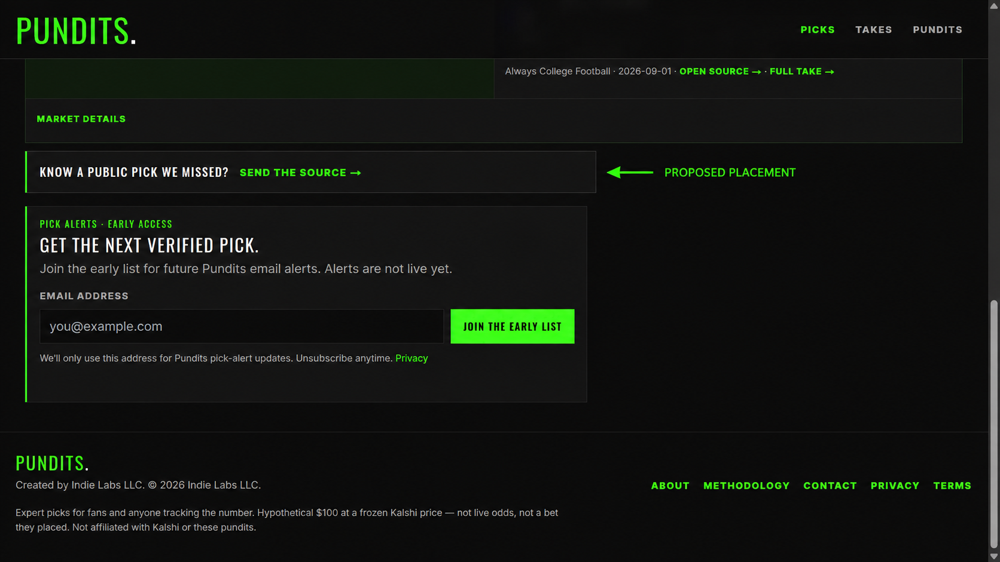

# Community tip placement review

Status: Evidence

Date: 2026-09-03

## Scope

Review the live Pundits.Pro homepage and event-detail experience to decide where a fan should send an original public source that the Scout workflow missed. This is a placement review, not approval for public community picks.

## User goal

A fan who notices a missing pundit pick should be able to send the original public source with minimal effort, while understanding that Pundits.Pro will independently verify it before publication.

## Flow review

### 1. Homepage entry

Health: **Strong as-is.** The first viewport has a clear job: explain the product through the next matchup, its faces, and its frozen prices. A new top-level navigation item or hero button would compete with the primary fan task. Empty-side text on scan cards should continue to open the event rather than launch a form.

### 2. Event context

Health: **Strong context for a submission prompt.** The event page establishes the matchup, current coverage, quotes, and original-source standard. A visitor has enough context here to understand what is missing and why the source matters.

### 3. Lower event-page actions

Health: **Good structure with room for one lightweight action.** A compact tip prompt can sit between the event card and the email-interest module. It should be visually quieter than the email conversion panel so the two actions do not look like competing primary forms.

### 4. Empty-side event

Health: **Best trigger for the feature.** “No verified pundit pick yet” creates the exact moment when a fan may know something the Scout system missed. On an open event detail page, the prompt should name the missing side: “Know a public Wisconsin pick? Send the source.”

## Recommendation

Use a dedicated `/submit/` page reached from two places:

1. A contextual prompt immediately below the event card on open event-detail pages. When a side is empty, name that side; otherwise say “Know another public pick we missed?” Preserve the existing empty-state text inside the card.
2. A permanent `Submit a pick` link in the footer for tips that are not tied to a currently displayed event.

Do not add the feature to the primary header, homepage hero, or scan-card controls. The header should remain Picks / Takes / Pundits, and the homepage should continue to lead with the next matchup.

### Proposed placement

The pictured band is the event-page entry point. Selecting `Send the source` opens the dedicated `/submit/` form with the current event context already filled in.

## Accessibility considerations

- Use a dedicated page rather than a modal so the flow has a stable URL, predictable browser history, and uncomplicated mobile and keyboard behavior.
- Give every field a visible label, connect field-level errors with `aria-describedby`, and announce submission status through an `aria-live` region.
- Keep buttons and links at least 44 CSS pixels tall in the interactive form treatment.
- Preserve the event and missing-side context in visible text; do not communicate it only through color.
- Move focus to the error summary or success heading after submission.

Screenshots confirm hierarchy and visible copy only. Keyboard order, focus treatment, validation behavior, assistive-technology output, and mobile reflow require implementation-time testing.
