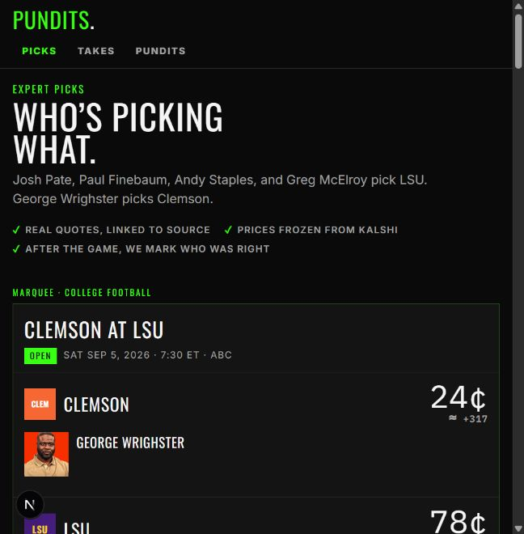
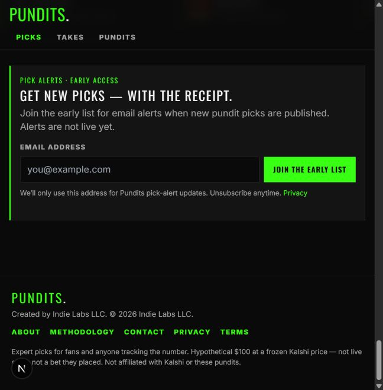

# Site navigation audit — 2026-09-03

## Scope

Local Pundits.Pro homepage at the current responsive browser width. Reviewed the global header and footer against the repository's public route inventory.

## Verdict

- Header: healthy as a compact primary-task navigation, but incomplete as full-site navigation.
- Footer: visually consistent, but not organized as a useful site map.

## Step 1 — Header

Health: needs a small information-architecture correction.

Strengths:

- The three visible destinations map to the main product jobs: browse picks, read sourced takes, and inspect pundit records.
- The logo provides a reliable home link.
- Header links have 44px-high touch targets, a visible active state, and a labeled navigation landmark.

Risks:

- College Football, NFL, and The Book are core indexable destinations but cannot be reached directly from the global navigation.
- `Picks` is visually and semantically marked as the current page on descendant routes even though its link returns to `/`; assistive-technology users can be told that a different destination is the current page.
- Adding every route directly to this row would make the mobile header crowded. Keep the three primary destinations and expose the missing destinations through a compact secondary menu or stronger footer.

## Step 2 — Footer

Health: needs restructuring.

Strengths:

- Brand ownership, methodology, contact, privacy, terms, and the market disclaimer are present.
- The footer is a labeled navigation landmark and wraps cleanly at the captured width.

Risks:

- The footer is a flat legal/company row rather than full-site navigation. It omits Picks, College Football, NFL, Takes, The Book, and Pundits.
- About, Methodology, Contact, Privacy, and Terms are mixed without grouping.
- Footer link hit areas measure about 18px high, below the header's 44px touch-target standard.

## Recommended structure

Keep the global header focused on `Picks`, `Takes`, and `Pundits`. Add a compact `More` menu only if direct access to College Football, NFL, and The Book is required from every page.

Turn the footer into three groups:

- Explore: Picks, College Football, NFL, Takes, The Book, Pundits
- About: About, Methodology, Contact
- Legal: Privacy, Terms

Retain the current brand block and frozen-market disclaimer. Increase footer link hit areas to at least 44px high on touch layouts.

## Evidence limits

This pass inspected the current responsive homepage, DOM semantics, link destinations, route inventory, and rendered target sizes. It did not complete a full keyboard, screen-reader, contrast, or every-route regression audit.
